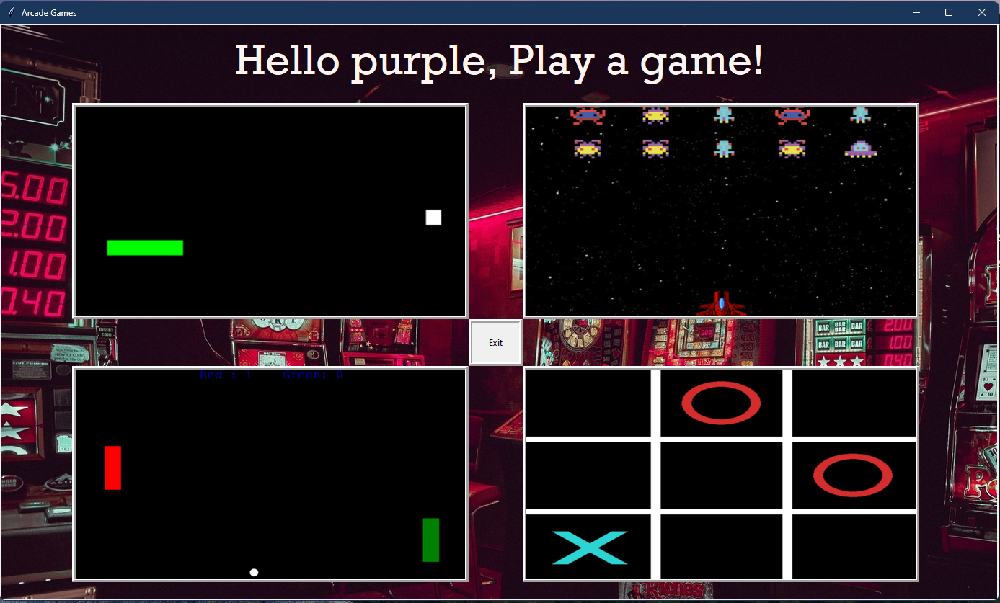

### Game explorer with GUI (tkinter) that lets the user play one of four games also made in python.  

<table>
  <td align="center"><b>Made using:</b></td>
  <td> 
    
  </td>
</table>

________________________________________________________________________________________________________________
### Files/folders needed to run:
1. pyGame.py
2. img (the folder)

### To run the file effectively, it is recommended that you have the following python libraries installed:

1. numPy
2. PyGame
3. tkinter
4. turtle

Also please remember to turn off restricted mode before running the program! 
_________________________________________________________________________________________________________________

## Features: 
* Shows picture of preview of games. 
* Shows instructions before game launch. 
* Allows user to set thier name before game launch.

## What I learned/used: 
* Python: tkinter, pygame, turtle, numpy
